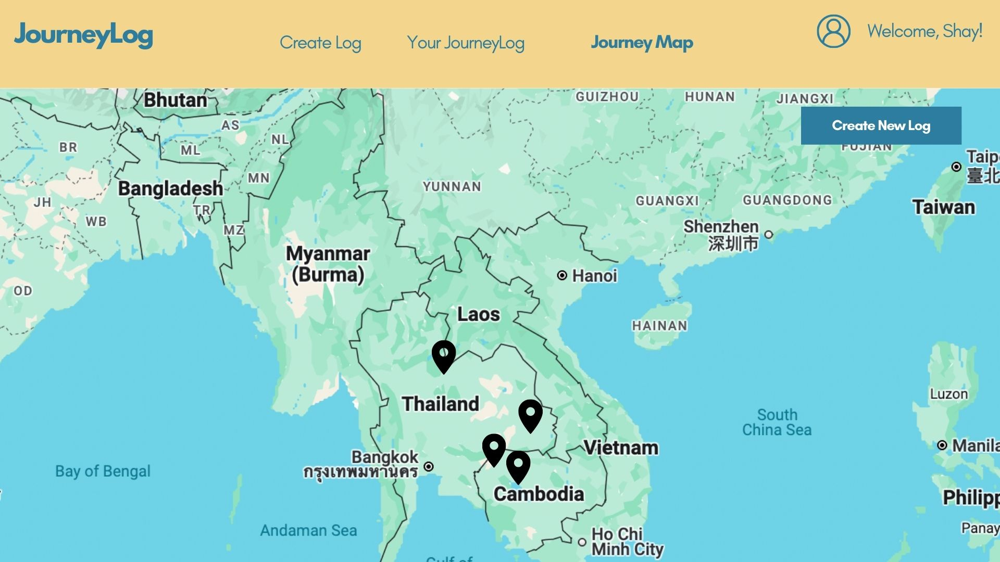
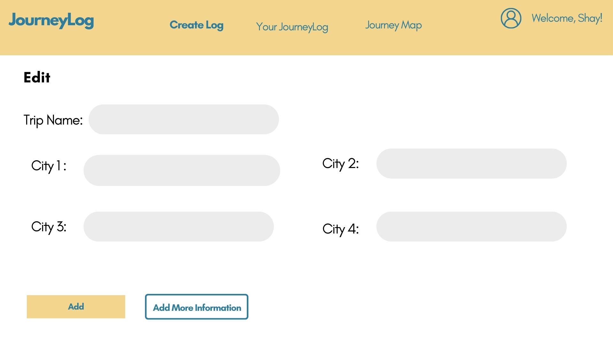

# Project Title
JourneyLog

## Overview

JourneyLog is a place for travellers to map their journeys, document their travels, and inspire other travellers who are building itineraries for their next journey.  

### Problem Space

As an avid traveller I have explored countless cities, restaurants, and tourist attractions. After some time, I find that event-specific memories start to fade, such as names of cities, restaurants, hotels, etc. Not only is this a sentimental loss, but it also makes the sharing of such experiences and recommedations difficult with others. Hard-copy travel journals degrade over time, and existing travel journal apps focus more on the experiences rather than the places. JourneyLog offers an easy-to-use tool for documenting experiences that can be refered back to for memories, or shared as recommendations for future trips. 

### User Profile

Travelers:
    - Wanting to log their travel footprint.
    - Looking to record which cities they've been to.
    - Wanting to remember the names of hotels, restaurants, and attractions associated with the traveled cities.


### Features

- As a user, I want to be able to create a journey log with a name and add multiple cities to it.

- As a user, I want to view a list of all my journey logs on the homepage.

- As a user, I want to select a journey log and see the cities I added along with additional details like notes, restaurants, and accommodations.

- As a user, I want to see the city details (notes, restaurants, accommodations) when I click on a pin on the map.

- As a user, I want my input (journey logs, cities, and details) to be saved so I can revisit my journey logs at any time.

- As a user, I want the app to guide me through an intuitive and visually appealing interface.

TIME PERMITTING:

- As a user, I want to add notes to a city in my journey log to document my experiences.

- As a user, I want to view a map with pins for all the cities in a selected journey log.

- As a user, I want to be able to edit or update the cities and details within an existing journey log.


## Implementation

### Tech Stack

- React
- Sass
- Axios
- React-Router
- Node.js
- Express

Client libraries:
- react
- react-router
- axios

Server libraries:
- express


### APIs

Google Maps API

### Sitemap

- Home Page
- Add New Log Page
- JourneyLog List
- JourneyMap Page

### Mockups

#### Home Page


#### Map Page


#### Log Page


#### Add New Log Page



### Data

JourneyLogs (trips)
- one JourneyLog contains one or more cities 

Cities
- Each city belongs to one JourneyLog
- Each city contains coordinate metadata

JourneyMap
- the city coordinates will be pulled from the cities of all of the JourneyLogs, and displayed as pins in the Journey Map.


### Endpoints


**GET /journeyLogs**
- fetch details of the trip
- Parameters: none
- Response:
```
    [
    {
    "id": 1,
    "name": "Europe Trip"
    }
    ]
```


***GET /journeylogs/:id***
- fetch detailed info about a specific JourneyLog including cities.
- Parameters: id
- Response:
```
    [
    {
    "id": 1,
    "name": "Europe Trip",
    "cities": [
        {
        "id": 1,
        "name": "Paris, France",
        "notes": "notes",
        "restaurants": "restaurants",
        "accomodations": "accomodations"
            "coordinates": {
                "latitude": 48.8588443,
                "longitude": 2.2943506
             }
            {
        "id": 2,
        "name": "Rome, Italy",
        "notes": "notes",
        "restaurants": "restaurants",
        "accomodations": "accomodations"
        "coordinates": {
            "latitude": 48.8588443,
            "longitude": 2.2943506
                }
        }
        }
        ]
        }
    ]
```


**POST /journeylogs**
- create new JourneyLog with trip name and cities
- hard code details for now (restaurants, accomodations, etc)
- Response:
```
    [
    {
    "id": 1,
    "name": "Europe Trip",
    "cities": [
        {
        "id": 1,
        "name": "Paris, France",
        "notes": "notes",
        "restaurants": "restaurants",
        "accomodations": "accomodations"
            "coordinates": {
                "latitude": 48.8588443,
                "longitude": 2.2943506
             }
            {
        "id": 2,
        "name": "Rome, Italy",
        "notes": "notes",
        "restaurants": "restaurants",
        "accomodations": "accomodations"
        "coordinates": {
            "latitude": 48.8588443,
            "longitude": 2.2943506
                }
        }
        }
        ]
        }
    ]
```

**GET journeylogs/:id/cities**
- fetch list of cities with coordinates
- parameters: id
- response:
```
    {
  "id": 1,
  "name": "Europe Trip",
  "cities": [
    {
      "id": 1,
      "name": "Paris, France",
      "coordinates": {
        "latitude": 48.8588443,
        "longitude": 2.2943506
      }
    }
    ]
    }
```

## Roadmap

Create Client

Create server

Connect client and server

Build framework and styling for navigation, footer

Build and style homepage front end

Build and style log log page front end

Build and style add new log page front end

Add endpoints

Implement dynamic data

Integrate Google Maps API 

Final polishing

---

## Future Implementations
- Login / user authentication
- log attraction pins under city pins
- attach comments and ratings to the pins
- expand capabilities for attaching comments 
- show pin information on hover
- DELETE functionality
- Update functionality
